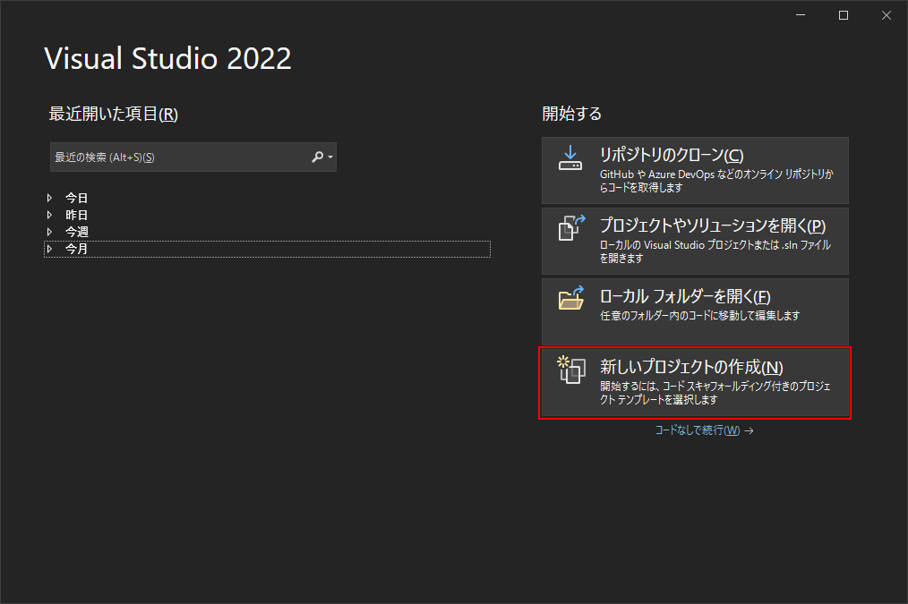
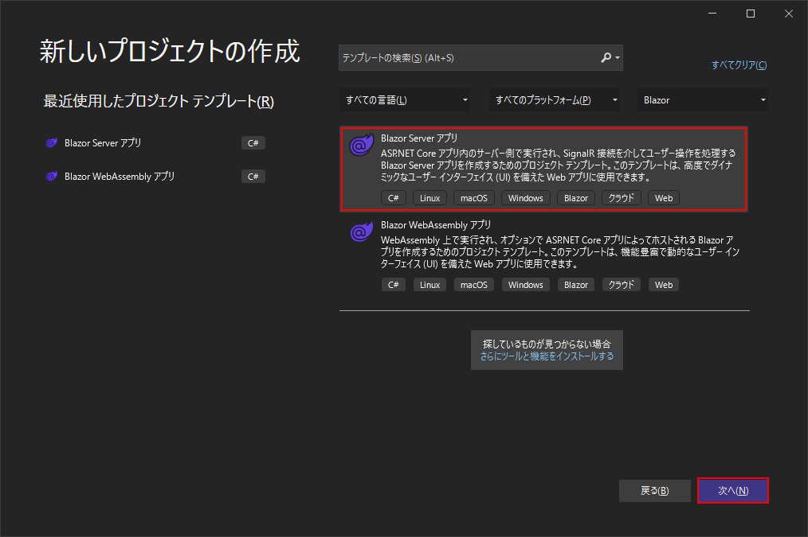
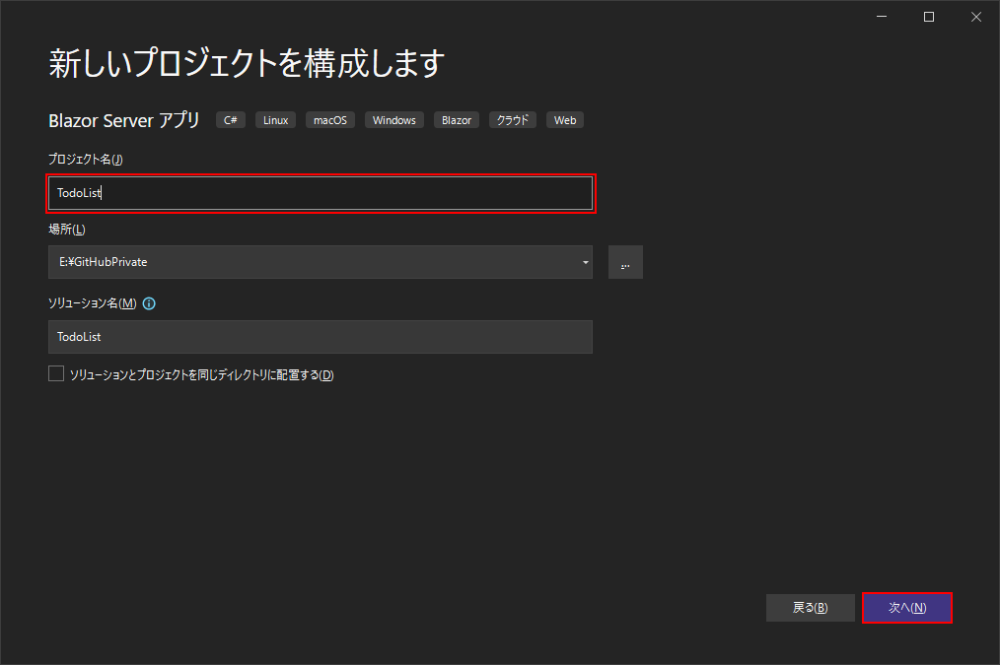
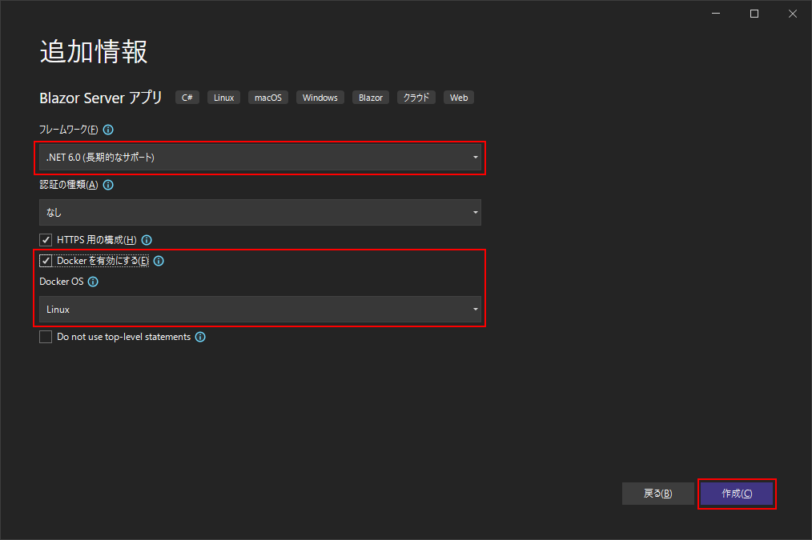
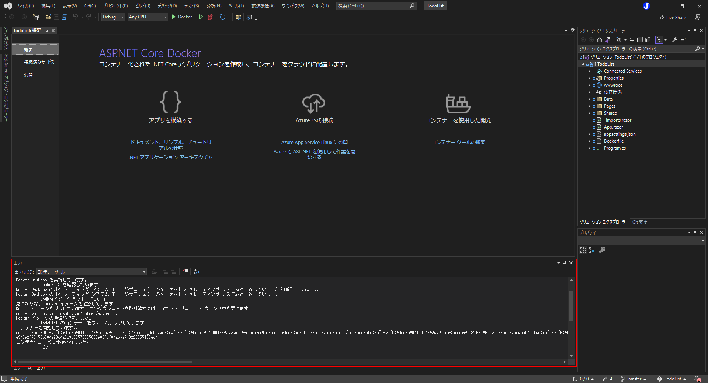
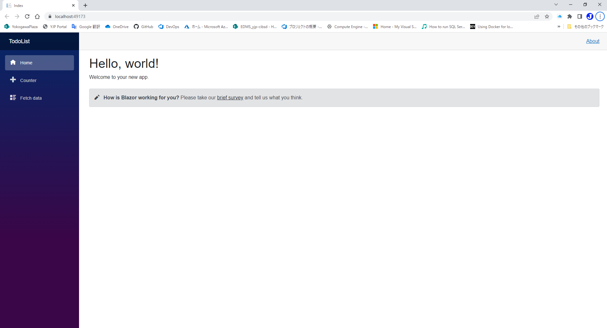

# プロジェクト新規作成
Visual Studio 2022でBlazor Serverのプロジェクトを新規作成します。
1. Visual Studio 2022を起動する。
1. 新しいプロジェクトの作成をクリックする。  

1. 「Blazor Server アプリ」を選択して、「次へ」ボタンをクリックする。  

1. プロジェクト名に **TodoList** と入力し、「次へ」ボタンをクリックする。  

1. フレームワークで **.NET 6.0(長期的なサポート)** を選択、**Docker を有効にする** にチェックを入れ、Docker OS を **Linux**にする。その後、「次へ」ボタンをクリックする。  

1. プロジェクトが新規作成され、開発用のコンテナが開始されるまで待つ。  
  
code:  [Step 1](https://github.com/04100149/TodoList/releases/tag/step1)

## 動作確認
1.  ボタンをクリックする。  
1. ビルド後、開発用コンテナが開始され、ブラウザが起動する。  

***
- Prev [前提条件](0000prerequisites.md)
- Next [プロジェクトの構造](0002projectstructure.md)

