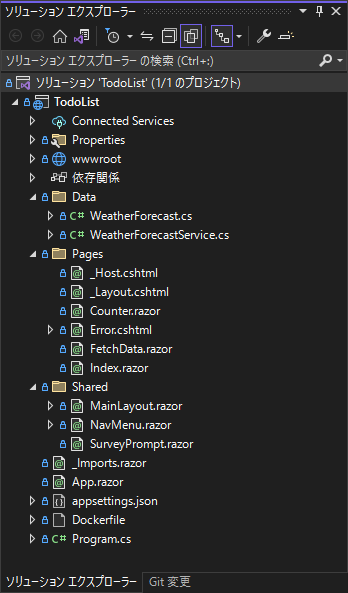

# プロジェクトの構造
code:  [Step 1](https://github.com/04100149/TodoList/releases/tag/step1)  

プロジェクトの構造は次の通り。  
  

| 項目 | 概要 |
|:-----------|:------------|
| ソリューション'TodoList' | ソリューションフォルダ |
| TodoList | プロジェクトフォルダ |
| Propertiesフォルダ | ローカル開発環境のプロファイル設定 |
| wwwrootフォルダ | Webサイトの静的ファイル置き場 |
| Dataフォルダ | データクラスやサービスを配置する |
| Pagesフォルダ | Webページを配置する |
| \_Layout.cshtml | レイアウト用のhtml。全てのページに適用されるため、JavaScriptはここで足す |
| Sharedフォルダ | サイドメニューやRazorコンポーネントなどの共有モジュールを配置する |
| MainLayout.razor | レイアウト用Razorコンポーネント |
| NavMenu.razor | サイドメニューRazorコンポーネント |
| \_Imports.razor | インポートファイル。このファイルに **@using** を書いておくと全てのrazorテンプレートに適用される |
| App.razor | アプリ向けルートコンポーネント |
| appsetting.json | 構成ファイル |
| Dockerfile | Docker用定義ファイル |
| program.cs | サーバーを起動するアプリのエントリ ポイントであり、アプリ サービスとミドルウェアを構成する場所 |

***
- Prev [プロジェクト新規作成](docs/0001newproject.md)
- Next [Webページの追加](docs/0003addrazorcomponent.md)

