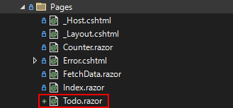
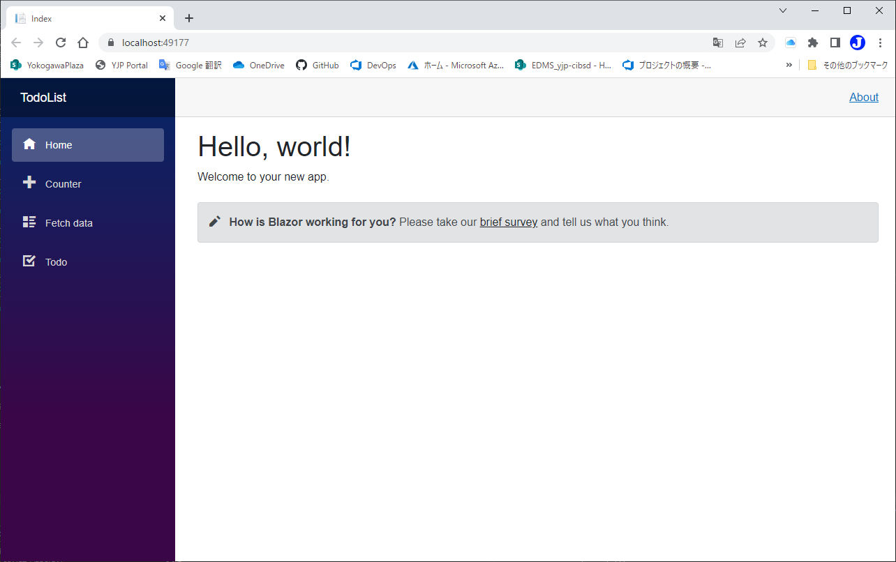
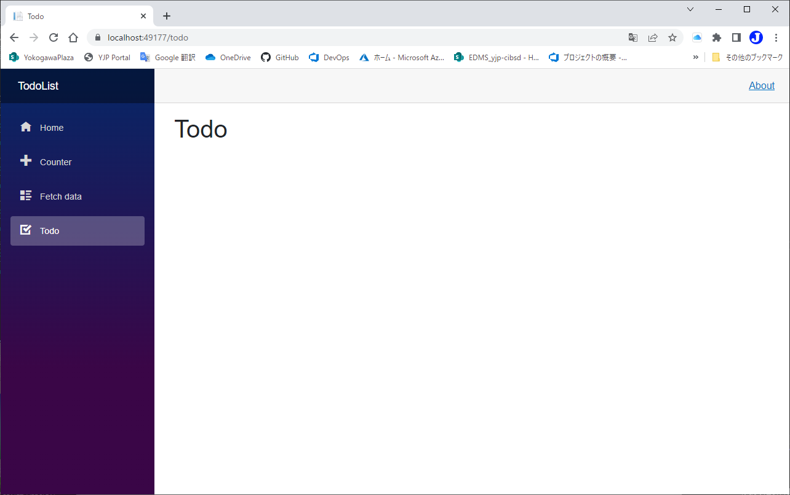

# Webページの追加
code:  [Step 01](https://github.com/04100149/TodoList/tree/step01)

## Point
- [Todoページを追加する。](#todo%E3%83%9A%E3%83%BC%E3%82%B8%E3%82%92%E8%BF%BD%E5%8A%A0%E3%81%99%E3%82%8B)
- [サイドメニューから呼び出せるようにする。](#%E3%82%B5%E3%82%A4%E3%83%89%E3%83%A1%E3%83%8B%E3%83%A5%E3%83%BC%E3%81%8B%E3%82%89%E5%91%BC%E3%81%B3%E5%87%BA%E3%81%9B%E3%82%8B%E3%82%88%E3%81%86%E3%81%AB%E3%81%99%E3%82%8B)

## 手順
### Todoページを追加する
1. ソリューション エクスプローラの **Pages** フォルダを右クリックし、 コンテキストメニューの **追加 - Razorコンポーネント** をクリックする。
1. 名前を **Todo.razor** にして **追加** ボタンを押す。
1. PagesフォルダにTodo.razorが追加される。  

1. Todo.razorを編集し、次のようにする。    
```HTML+razor
@page "/todo"

<PageTitle>Todo</PageTitle>

<h1>Todo</h1>

@code {

}
```
5. [Todo.razor](https://github.com/04100149/TodoList/blob/step02/TodoList/Pages/Todo.razor)を保存する。  
### サイドメニューから呼び出せるようにする。
1. **Shared** フォルダの **NavMenu.razor** を開く。  
1. NavMenu.razorに次のコードを追加する。    
```diff
     <nav class="flex-column">
         <div class="nav-item px-3">
             <NavLink class="nav-link" href="" Match="NavLinkMatch.All">
                 <span class="oi oi-home" aria-hidden="true"></span> Home
             </NavLink>
         </div>
         <div class="nav-item px-3">
             <NavLink class="nav-link" href="counter">
                 <span class="oi oi-plus" aria-hidden="true"></span> Counter
             </NavLink>
         </div>
         <div class="nav-item px-3">
             <NavLink class="nav-link" href="fetchdata">
                 <span class="oi oi-list-rich" aria-hidden="true"></span> Fetch data
             </NavLink>
         </div>
+        <div class="nav-item px-3">
+            <NavLink class="nav-link" href="todo">
+                <span class="oi oi-task" aria-hidden="true"></span> Todo
+            </NavLink>
+        </div>
     </nav>
```
- **NavLink** がクリックされると、**href** アトリビュートに設定されているページに遷移する。この場合、**@page "/todo"** と宣言されているTodo.razorに遷移する。  
3. [NavMenu.razor](https://github.com/04100149/TodoList/blob/step02/TodoList/Shared/NavMenu.razor)を保存する。  

code:  [Step 02](https://github.com/04100149/TodoList/tree/step02)

**参考** [ASP.NET Core の Blazor ルーティングとナビゲーション](https://docs.microsoft.com/ja-jp/aspnet/core/blazor/fundamentals/routing?view=aspnetcore-6.0)

## 動作確認
1.  ボタンをクリックする。  
1. ビルド後、開発用コンテナが開始され、ブラウザが起動する。  

1. サイドメニューの **Todo** をクリックすると、Todoページが開く。    


***
- Prev [プロジェクトの構造](0002projectstructure.md)
- Next [Iconのスタイルを確認する](0004icons.md)

