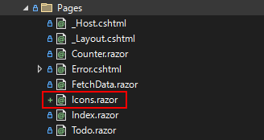
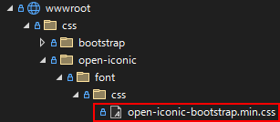
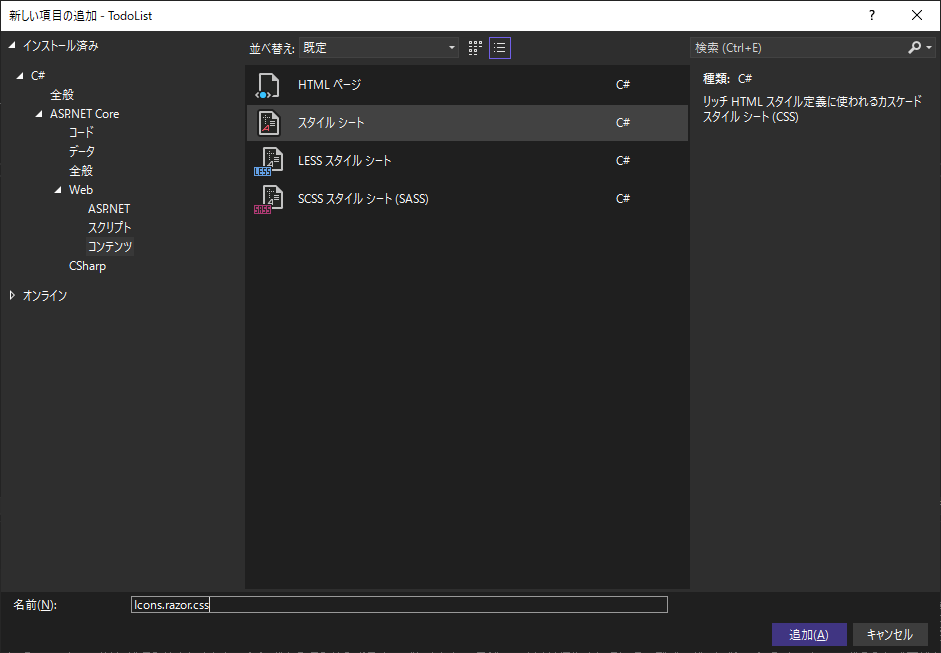
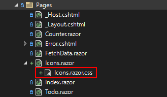
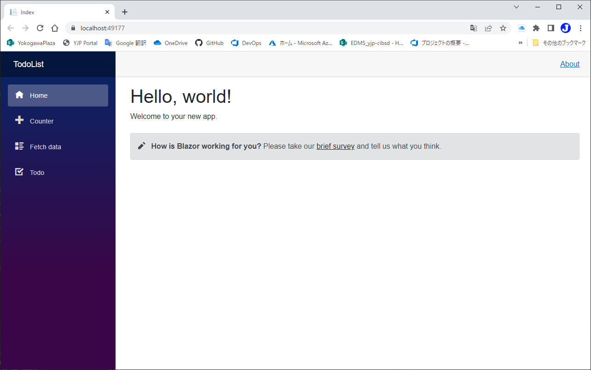
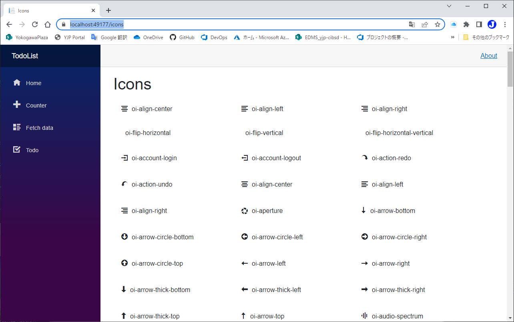

# Iconのスタイルを確認する。
code:  [Step 2](https://github.com/04100149/TodoList/releases/tag/step2)  

## Point
- [Icon確認ページを追加する](#icon%E7%A2%BA%E8%AA%8D%E3%83%9A%E3%83%BC%E3%82%B8%E3%82%92%E8%BF%BD%E5%8A%A0%E3%81%99%E3%82%8B)
- [静的ファイルを読み込む](#%E9%9D%99%E7%9A%84%E3%83%95%E3%82%A1%E3%82%A4%E3%83%AB%E3%82%92%E8%AA%AD%E3%81%BF%E8%BE%BC%E3%82%80)
- [CSSでスタイルを変更する](#css%E3%81%A7%E3%82%B9%E3%82%BF%E3%82%A4%E3%83%AB%E3%82%92%E5%A4%89%E6%9B%B4%E3%81%99%E3%82%8B)

## 手順
### Icon確認ページを追加する
1. ソリューション エクスプローラの **Pages** フォルダを右クリックし、 コンテキストメニューの **追加 - Razorコンポーネント** をクリックする。
1. 名前を **Icons.razor** にして **追加** ボタンを押す。
1. PagesフォルダにIcons.razorが追加される。  

1. Icons.razorを編集し、次のようにする。    
```HTML+razor
@page "/icons"

<PageTitle>Icons</PageTitle>

<h1>Icons</h1>

@if(icons != null)
{
    <div >
        @foreach(var icon in icons)
        {
            <div>
                <span class="oi @icon" style="margin: 10px" />@icon
            </div>
        }
    </div>
}


@code {
    private List<string> icons;

}
```
5. Icons.razorを保存する。  
### 静的ファイルを読み込む
- Iconは、[open-iconic-bootstrap.min.css](https://github.com/04100149/TodoList/blob/master/TodoList/wwwroot/css/open-iconic/font/css/open-iconic-bootstrap.min.css)ファイルにcssとして定義されている。  

- Iconは次のように定義されている。
```CSS
….oi-task:before{content:'\e0c8'}…
```
- Iconsページが読み込まれたときに、[open-iconic-bootstrap.min.css](https://github.com/04100149/TodoList/blob/master/TodoList/wwwroot/css/open-iconic/font/css/open-iconic-bootstrap.min.css)ファイルを読み込み、正規表現で`oi-***`を抽出する。
1. Icons.razorを開き、`@code{}`内に`OnInitializedAsync()`を追加する。
```HTML+razor
    protected override async Task OnInitializedAsync()
    {
        List<string> names = new List<string>();

        using(StreamReader sr = new StreamReader(@"./wwwroot/css/open-iconic/font/css/open-iconic-bootstrap.min.css"))
        {
            string css = await sr.ReadToEndAsync();

            foreach(Match m in Regex.Matches(css, @"[.]oi-[^:]+"))
            {
                if (m.Success)
                {
                    names.Add(m.Value.Substring(1));
                }
            }
        }
        icons = names;
    }
```
2. 正規表現を使用するので、`@using System.Text.RegularExpressions`を追加する。
```diff
 @page "/icons"
+@using System.Text.RegularExpressions
 
 <PageTitle>Icons</PageTitle>
```
3. Icons.razorを保存する。
### CSSでスタイルを変更する
- Razorコンポーネントは、同じフォルダに`ファイル名+".css"`という名前でcssファイルを作っておくと、そのコンポーネントだけに適応される。
1. ソリューション エクスプローラの **Pages** フォルダを右クリックし、 コンテキストメニューの **追加 - クラス** をクリックする。
1. `スタイル シート`を選択する。  

1. 名前を **Icons.razor.css** にして **追加** ボタンを押す。
1. PagesフォルダにIcons.razor.cssが追加される。  

1. Icons.razor.cssを編集し、次のようにする。    
```CSS
.thumbnail {
    width: 300px;
    display: inline-block;
    vertical-align: top;
    margin-bottom: 10px;
    padding: 10px;
    box-sizing: border-box;
}
```
6. Icons.razor.cssを保存する。  
1. Icons.razorを開く。
1. divエレメントにスタイルを設定する。
```diff
        @foreach(var icon in icons)
        {
-            <div>
+            <div class="thumbnail">
                <span class="oi @icon" style="margin: 10px" />@icon
            </div>
        }
```
9. Icons.razorを保存する。


code:  [Step 3](https://github.com/04100149/TodoList/releases/tag/step3)  

## 動作確認
1.  ボタンをクリックする。  
1. ビルド後、開発用コンテナが開始され、ブラウザが起動する。  

1. ブラウザのアドレスに`/icons`を追加して`Enter`キーを押す。    


***
- Prev [Webページの追加](docs/0003addrazorcomponent.md)
- Next [Todoを足せるようにする](docs/0005addtodo.md)

