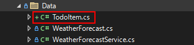
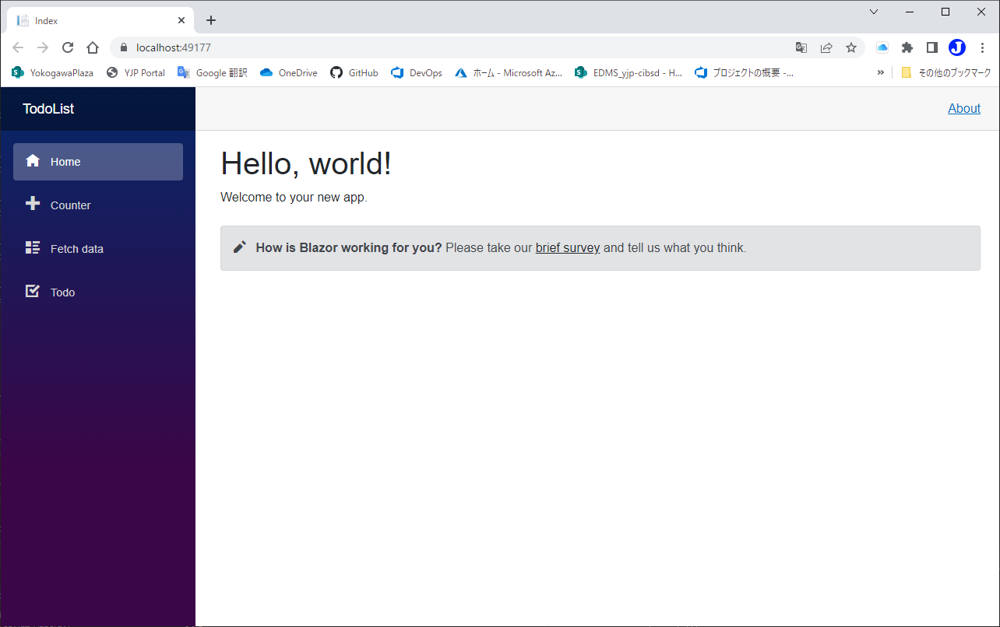
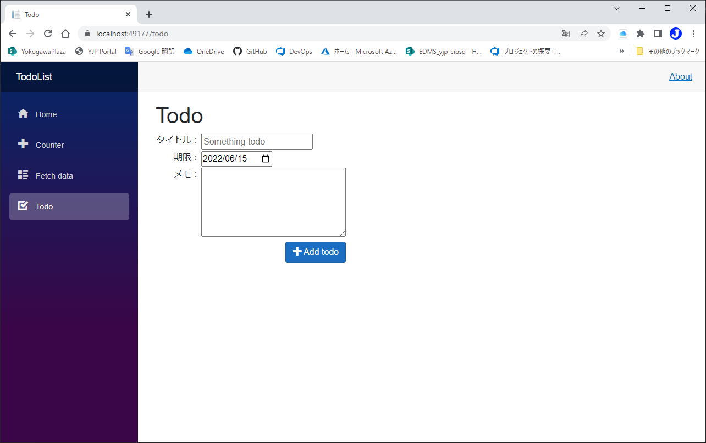
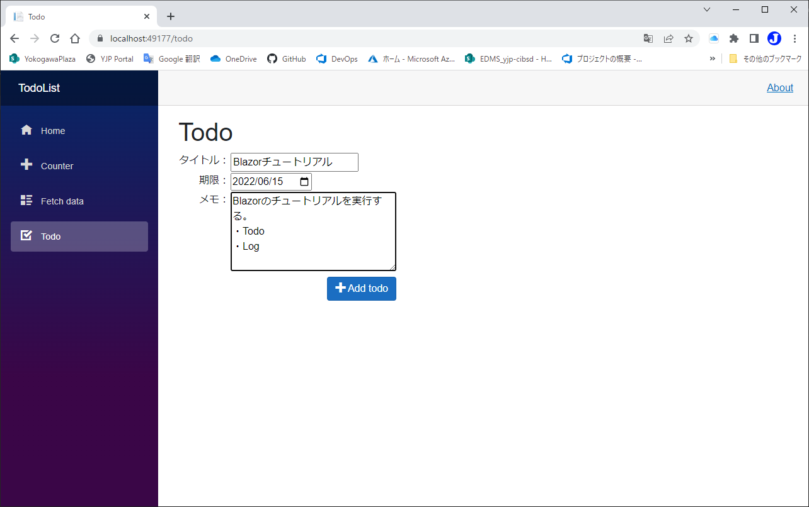
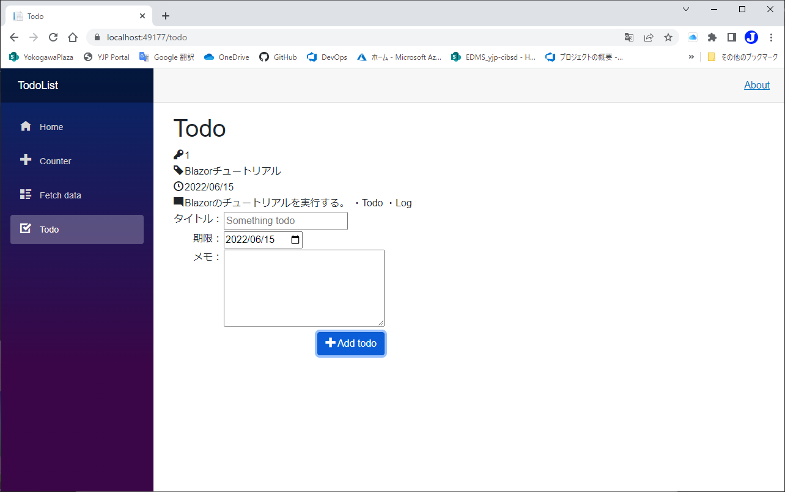

# Todoを足せるようにする
code:  [Step 3](https://github.com/04100149/TodoList/releases/tag/step3)  

## Point
- [データモデルを追加する](#%E3%83%87%E3%83%BC%E3%82%BF%E3%83%A2%E3%83%87%E3%83%AB%E3%82%92%E8%BF%BD%E5%8A%A0%E3%81%99%E3%82%8B)
- [データを表示する](#%E3%83%87%E3%83%BC%E3%82%BF%E3%82%92%E8%A1%A8%E7%A4%BA%E3%81%99%E3%82%8B)
- [入力項目を追加する](#%E5%85%A5%E5%8A%9B%E9%A0%85%E7%9B%AE%E3%82%92%E8%BF%BD%E5%8A%A0%E3%81%99%E3%82%8B)

## 手順
### データモデルを追加する
1. ソリューション エクスプローラの **Data** フォルダを右クリックし、 コンテキストメニューの **追加 - クラス** をクリックする。
1. 名前を **TodoItem.cs** にして **追加** ボタンを押す。
1. DataフォルダにTodoItem.csが追加される。  

1. TodoItem.csを編集し、次のようにする。    
```C#
namespace TodoList.Data
{
    public class TodoItem
    {
        public int Id { get; set; }
        public string Title { get; set; }
        public DateTime TargetDate { get; set; }
        public string Memo { get; set; }
        public DateTime EndDate { get; set; } = DateTime.MinValue;
        public bool IsDone { get; set; } = false;
    }
}
```
5. TodoItem.csを保存する。  
### データを表示する
1. Todo.razorを開き、`@code{}`内に`TodoItem`のリストを追加する。
1. `TodoItem`を使うために`@using TodoList.Data`を追加する。
```diff
 @page "/todo"
+@using TodoList.Data
 
 <PageTitle>Todo</PageTitle>
 
 <h1>Todo</h1>
 
 @code {
+    private List<TodoItem> todos = new();
 
 }
```
3. `@foreach`を使い、`todos`の情報を表示する。
```HTML+razor
<div>
    @foreach(var todo in todos)
    {
    <table>
        <tr>
            <td align="right" valign="top"><span class="oi oi-key"/></td>
            <td>@todo.Id</td>
        </tr>
        <tr>
            <td align="right" valign="top"><span class="oi oi-tag"/></td>
            <td>@todo.Title</td>
        </tr>
        <tr>
            <td align="right" valign="top"><span class="oi oi-clock"/></td>
            <td>@todo.TargetDate.ToString("yyyy/MM/dd")</td>
        </tr>
        <tr>
            <td align="right" valign="top"><span class="oi oi-comment-square"/></td>
            <td >@todo.Memo</td>
        </tr>
    </table>        
    }
</div>
```
4. Icons.razorを保存する。
### 入力項目を追加する
- `input`や`textarea`で入力項目を作成する。  
- 入力項目と変数を`@bind`で紐づける。
- 追加ボタンに`@onclick`でTodo追加用の関数と紐づける。
1. Todo.razorを開き、入力項目を追加する。
```HTML+razor
<div>
    <table>
        <tr>
            <td align="right" valign="top">タイトル：</td>
            <td><input placeholder="Something todo" @bind="newTodo"/></td>
        </tr>
        <tr>
            <td align="right" valign="top">期限：</td>
            <td><input type="date" @bind="newDate"/></td>
        </tr>
        <tr>
            <td align="right" valign="top">メモ：</td>
            <td><textarea cols="30" rows="5" @bind="newMemo"/></td>
        </tr>
        <tr>
            <td colspan="2" align="right">
                <button class="btn btn-primary" @onclick="AddTodo">
                    <span class="oi oi-plus" /> Add todo
                </button>
            </td>
        </tr>
    </table>
</div>
```
2. `@code{}`内に入力情報用の変数を追加する。
```C#
    private int latestId = 1;
    private string? newTodo;
    private DateTime newDate = DateTime.Today.AddDays(7);
    private string newMemo;
```
3. `@code{}`内にTodo追加用の関数を追加する。
```C#
    private void AddTodo()
    {
        if (!string.IsNullOrWhiteSpace(newTodo))
        {
            TodoItem todo = new TodoItem {Id=latestId++, Title = newTodo, TargetDate = newDate, Memo=newMemo };
            newTodo = string.Empty;
            newMemo = string.Empty;
            todos.Add(todo);
        }
    }
```
4. [Icons.razor]()を保存する。

code:  [Step 4](https://github.com/04100149/TodoList/releases/tag/step4)  

## 動作確認
1.  ボタンをクリックする。  
1. ビルド後、開発用コンテナが開始され、ブラウザが起動する。  

1. サイドメニューの **Todo** をクリックすると、Todoページが開く。    

1. 情報を入力する。    

1. **Add todo** をクリックすると、Todoが追加される。    



