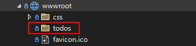
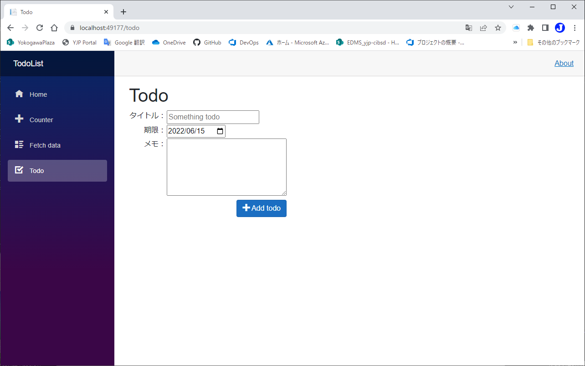
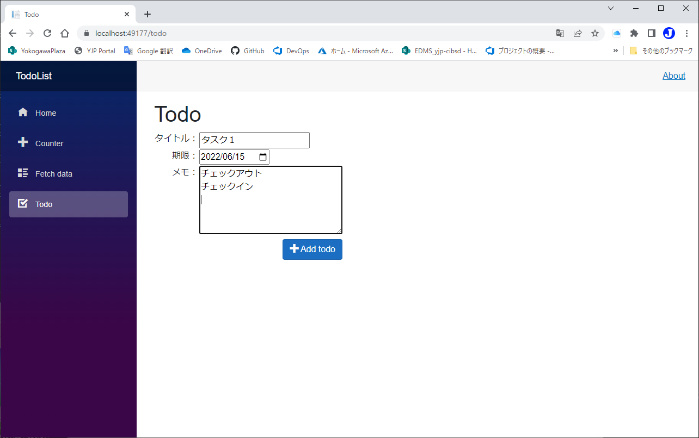
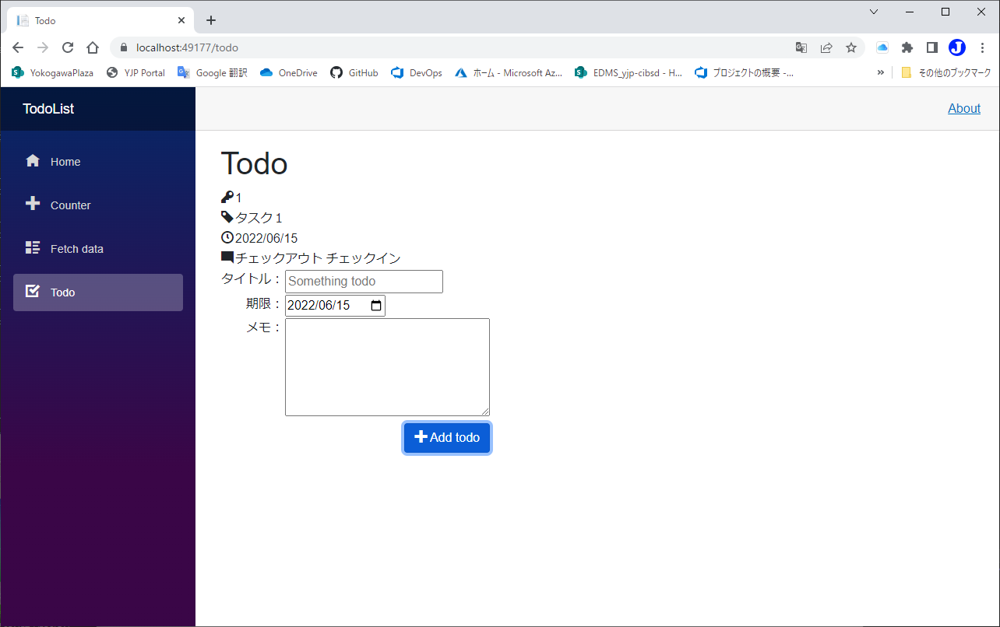
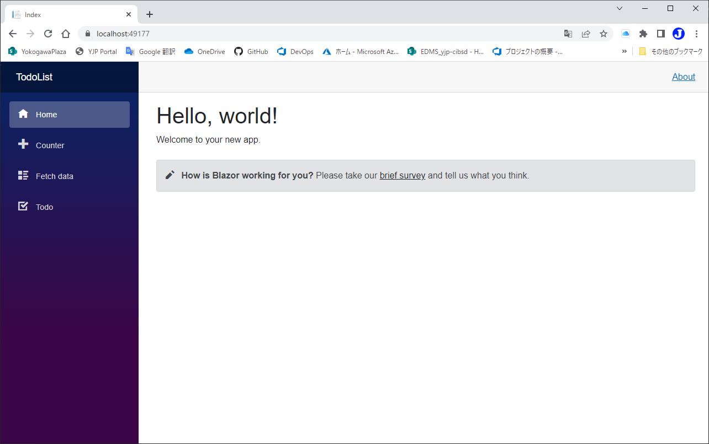
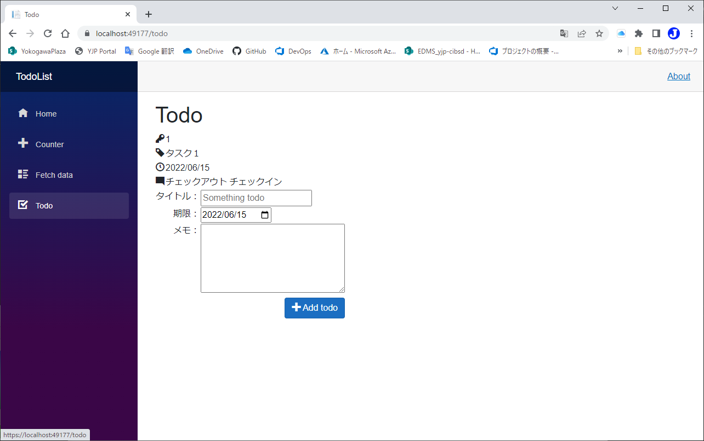

# データを永続化する
code:  [Step 4](https://github.com/04100149/TodoList/releases/tag/step4)  

## Point
- [永続化の設計をする]()
- [Todoを保存できるようにする]()
- [Todoを読み込めるようにする]()

## 手順
### 永続化の設計をする
- 一般的には、データの永続化はデータベースを使用することが多いが、ここではファイルを使用する。
  - `TodoItem`ごとにjsonファイルとして出力する。
  - jsonファイルの名前は、`{Id}.json`とする。
  - jsonファイルは、`./wwwroot/todos`フォルダに格納する。
1. ソリューション エクスプローラの **wwwroot** フォルダを右クリックし、 コンテキストメニューの **追加 - 新しいフォルダー** をクリックする。
1. `todos`という名前に変更する。  

### Todoを保存できるようにする
- `TodoItem`インスタンスを`JsonSerializer`でシリアライズし、ファイルに保存する。
1. Todo.razorを開き、`@code{}`内に保存用のコードを追加する。
```C#
    #region 永続化
    private const string todoFolder = @"./wwwroot/todos";

    private string GetPath(int id)
    {
        return string.Format(@"{0}/{1}.json", todoFolder, id);        
    }

    private void SaveTodoFile(TodoItem todo)
    {
        string json = JsonSerializer.Serialize(todo);
        string path = GetPath(todo.Id);
        using(StreamWriter sw = new StreamWriter(path, false, Encoding.UTF8))
        {
            sw.Write(json);
        }
    }
    #endregion 永続化
```
2. `@using System.Text`と`@using System.Text.Json`を追加する。
```diff
 @page "/todo"
+@using System.Text
+@using System.Text.Json
 @using TodoList.Data
```
3. Todoを追加したときに保存するように、`AddTodo()`メソッドの中で、`SaveTodoFile()`を呼び出す。
```diff
     private void AddTodo()
     {
         if (!string.IsNullOrWhiteSpace(newTodo))
         {
             TodoItem todo = new TodoItem {Id=latestId++, Title = newTodo, TargetDate = newDate, Memo=newMemo };
             newTodo = string.Empty;
             newMemo = string.Empty;
             todos.Add(todo);
+            SaveTodoFile(todo);
         }
     }
```
### Todoを読み込めるようにする
- `./wwwroot/todos`に格納されているファイルをリストアップする。
- ファイルごとに、`JsonSerializer`でデシリアライズし`TodoItem`インスタンスを`todos`変数に追加する。
1. Todo.razorを開き、`#region 永続化`内に読み込み用のコードを追加する。
```C#
    private List<TodoItem> LoadTodoFiles()
    {
        List<TodoItem> todos = new List<TodoItem>();
        foreach(var path in Directory.EnumerateFiles(todoFolder))
        {
            using(StreamReader sr = new StreamReader(path, Encoding.UTF8))
            {
                string json = sr.ReadToEnd();
                TodoItem? todo = JsonSerializer.Deserialize<TodoItem>(json);
                if (todo != null)
                {
                    todos.Add(todo);
                }
            }
        }
        return todos;
    }
```
2. `@code{}`内に`OnInitialized()`を追加し、`LoadTodoFiles()`を呼び出す。
```C#
    protected override void OnInitialized()
    {
        todos = LoadTodoFiles();
    }
```
3. `latestId`を読み込んだ **Idの最大値+1** に設定する。
```diff
     protected override void OnInitialized()
     {
         todos = LoadTodoFiles();
+        latestId = todos.Select<TodoItem, int>(x => x.Id).DefaultIfEmpty().Max() + 1;
     }
```
4. [Icons.razor]()を保存する。

code:  [Step 5](https://github.com/04100149/TodoList/releases/tag/step5)  

## 動作確認
1.  ボタンをクリックする。  
1. ビルド後、開発用コンテナが開始され、ブラウザが起動する。  

1. サイドメニューの **Todo** をクリックすると、Todoページが開く。    

1. 情報を入力する。    

1. **Add todo** をクリックすると、Todoが追加される。    

1. サイドメニューの **Home** をクリックすると、Homeページが開く。    

1. サイドメニューの **Todo** をクリックすると、Todoページが開く。**Todoが読み込まれている**    


