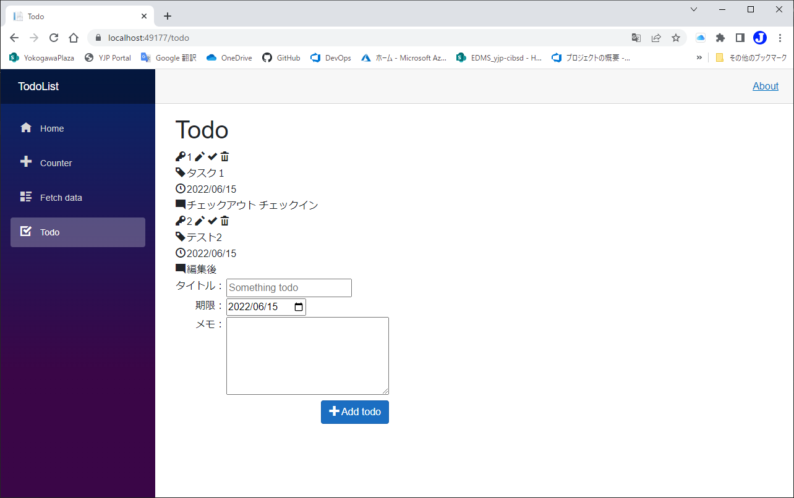

# Todoを編集/完了/削除できるようにする
code:  [Step 05](https://github.com/04100149/TodoList/tree/step05)

## Point
- [Todoを編集できるようにする](#todo%E3%82%92%E7%B7%A8%E9%9B%86%E3%81%A7%E3%81%8D%E3%82%8B%E3%82%88%E3%81%86%E3%81%AB%E3%81%99%E3%82%8B)
- [Todoを完了できるようにする](#todo%E3%82%92%E5%AE%8C%E4%BA%86%E3%81%A7%E3%81%8D%E3%82%8B%E3%82%88%E3%81%86%E3%81%AB%E3%81%99%E3%82%8B)
- [Todoを削除できるようにする](#todo%E3%82%92%E5%89%8A%E9%99%A4%E3%81%A7%E3%81%8D%E3%82%8B%E3%82%88%E3%81%86%E3%81%AB%E3%81%99%E3%82%8B)

## 手順
### Todoを編集できるようにする
- 編集中の`TodoItem`を示す`editingItem`を用意する。
- 編集中は表示を変更する。
  - IDを表示する。
  - **Add todo**ボタンを非表示にする。
  - **Done**ボタンと**Cancel**ボタンを表示する。
1. Todo.razorを開き、`@code{}`内に編集用のコードを追加する。
```C#
    private TodoItem? editingItem = null;

    private void EditTodo(TodoItem todo)
    {
        editingItem = todo;
        newTodo = todo.Title;
        newDate = todo.TargetDate;
        newMemo = todo.Memo;
    }

    private void InitializeEdit()
    {
        newTodo = string.Empty;
        newMemo = string.Empty;
        newDate = DateTime.Today.AddDays(7);
        editingItem = null;        
    }

    private void CancelEdit()
    {
        InitializeEdit();
    }

    private void DoneEdit()
    {
        if (!string.IsNullOrWhiteSpace(newTodo))
        {
            editingItem.Title = newTodo;
            editingItem.TargetDate = newDate;
            editingItem.Memo = newMemo;
            SaveTodoFile(editingItem);
            InitializeEdit();
        }
    }
```
2. 編集用ボタンを追加する。
```diff
         <tr>
             <td align="right" valign="top"><span class="oi oi-key"/></td>
-            <td>@todo.Id</td>            
+            <td>
+                @todo.Id
+                <span class="oi oi-pencil" @onclick=@(_=>EditTodo(todo)) />
+            </td>
         </tr>
```
3. 編集中はIDを表示する。
```diff
     <table>
+        @if (editingItem != null)
+        {
+        <tr>
+            <td align="right" valign="top">ID：</td>
+            <td>@editingItem.Id</td>
+        </tr>
+        }
         <tr>
             <td align="right" valign="top">タイトル：</td>
             <td><input placeholder="Something todo" @bind="newTodo"/></td>
         </tr>
```
4. 編集中はボタンを変更する。
```diff
         <tr>
             <td colspan="2" align="right">
+            @if(editingItem == null)
+            {
                 <button class="btn btn-primary" @onclick="AddTodo">
                     <span class="oi oi-plus" /> Add todo
                 </button>
+            }
+            else
+            {
+                <button class="btn btn-primary" @onclick="DoneEdit">
+                    <span class="oi oi-check" /> Done
+                </button>
+                <button class="btn btn-primary" @onclick="CancelEdit">
+                    <span class="oi oi-x" /> Cancel
+                </button>
+            }
            </td>
        </tr>
```
5. Todo.razorを保存する。
### Todoを完了できるようにする
- 完了ボタンで`IsDone`を`true`に設定する。
- 完了ボタンを追加する。
- 完了したTodoは非表示にする。
- 完了したTodoは編集できなくする。
1. Todo.razorを開き、`@code{}`内に完了用のコードを追加する。
```C#
    private void DoneTodo(TodoItem todo)
    {
        todo.EndDate = DateTime.Today;
        todo.IsDone = true;
        SaveTodoFile(todo);
    }
```
2. 完了ボタンを追加する。
```diff
             <td>
                 @todo.Id
                 <span class="oi oi-pencil" @onclick=@(_=>EditTodo(todo)) />
+                <span class="oi oi-check" @onclick=@(_=>DoneTodo(todo)) />
             </td>
```
3. `todos`のうちIsDoneがfalaseのものだけリストアップする。
```diff
 <div>
-    @foreach(var todo in todos)
+    @foreach(var todo in todos.Where<TodoItem>(x=>!x.IsDone))
     {
     <table>
```
4. IsDoneがtrueのものは編集できなくする。
```diff
     private void EditTodo(TodoItem todo)
     {
+        if (todo.IsDone){ return; }
         editingItem = todo;
         newTodo = todo.Title;
         newDate = todo.TargetDate;
         newMemo = todo.Memo;
     }
```
5. Todo.razorを保存する。
### Todoを削除できるようにする
- 削除ボタンで`todos`から削除する。
- 保存したファイルも削除する。
1. Todo.razorを開き、`#region 永続化`内にファイル削除用のコードを追加する。
```C#
    private void RemoveTodoFile(int id)
    {
        string path = GetPath(id);
        try
        {
            File.Delete(path);    
        }
        catch(Exception ex)
        {
            System.Diagnostics.Trace.WriteLine(ex.Message);
        }
    }
```
2. `@code{}`内に削除用のコードを追加する。
```C#
    private void RemoveTodo(TodoItem todo)
    {
        todos.Remove(todo);
        RemoveTodoFile(todo.Id);
    }
```
3. 削除ボタンを追加する。
```diff
             <td>
                 @todo.Id
                 <span class="oi oi-pencil" @onclick=@(_=>EditTodo(todo)) />
                 <span class="oi oi-check" @onclick=@(_=>DoneTodo(todo)) />
+                <span class="oi oi-trash" @onclick=@(_=>RemoveTodo(todo)) />
             </td>
```
4. [Todo.razor](https://github.com/04100149/TodoList/blob/step06/TodoList/Pages/Todo.razor)を保存する。

code:  [Step 06](https://github.com/04100149/TodoList/tree/step06) 

## 動作確認
1.  ボタンをクリックする。  
1. ビルド後、開発用コンテナが開始され、ブラウザが起動する。  

1. サイドメニューの **Todo** をクリックすると、Todoページが開く。    

1. 情報を入力し、**Add todo** をクリックすると、Todoが追加される。   

1. 編集ボタンをクリックすると、編集できる。   

1. **Cancel**をクリックすると、編集を破棄できる。   
1. **Done**をクリックすると、編集を反映できる。   

1. 完了ボタンをクリックすると、表示からきえる。   

1. 削除ボタンをクリックすると、表示からきえる。   


***
- Prev [データを永続化する](0006persistence.md)
- Next [完了したTodoを表示できるようにする](0008showclosed.md)

