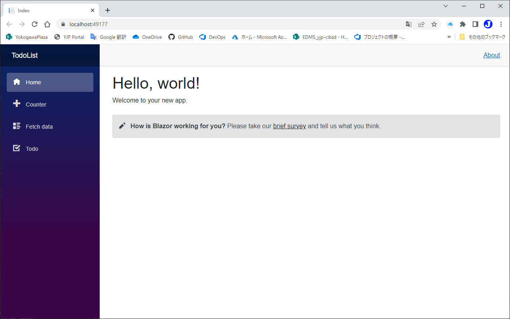
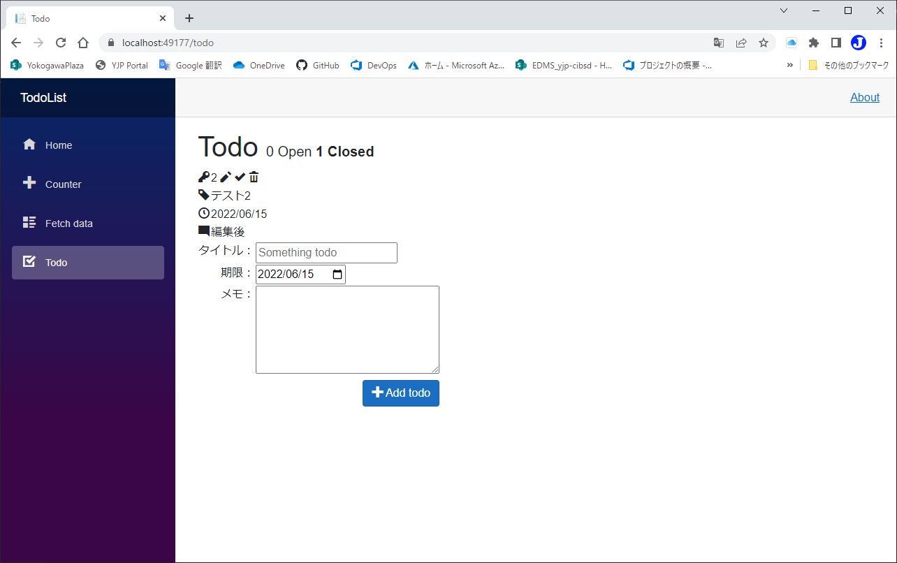
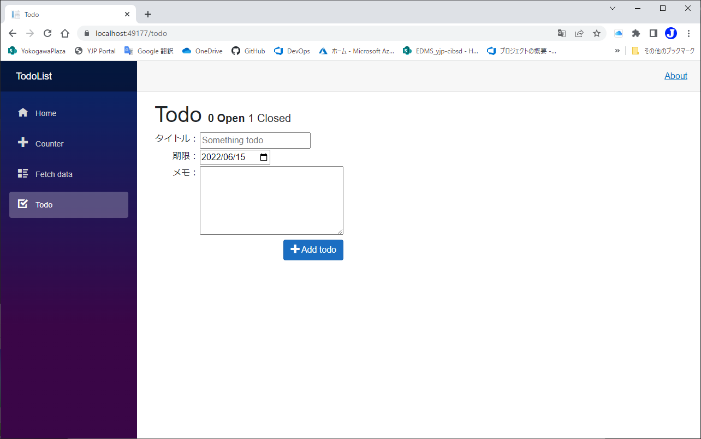

# 完了したTodoを表示できるようにする
code:  [Step 6](https://github.com/04100149/TodoList/releases/tag/step6)  

## Point
- [Todoの数を表示する](#todo%E3%81%AE%E6%95%B0%E3%82%92%E8%A1%A8%E7%A4%BA%E3%81%99%E3%82%8B)
- [表示モードを変更する](#%E8%A1%A8%E7%A4%BA%E3%83%A2%E3%83%BC%E3%83%89%E3%82%92%E5%A4%89%E6%9B%B4%E3%81%99%E3%82%8B)

## 手順
### Todoの数を表示する
1. Todo.razorを開き、Todoの数を表示する。
```diff
-<h1>Todo</h1>
+<h1>Todo 
+    <span style="font-size: 0.5em;">
+        <span>@todos.Count(todo=>!todo.IsDone) Open</span>
+        <span>@todos.Count(todo=>todo.IsDone) Closed</span>
+    </span>
+</h1>
```
### 表示モードを変更する
1. 表示モードを示す変数`showClosed`を`@code{}`内に追加する。
```diff
 @code {
     private List<TodoItem> todos = new();
 
+    private bool showClosed = false;
 
     private int latestId = 1;
```
2. `showClosed`がtrueの場合は、すべてのTodoを表示するように変更する。
```diff
 <div>
-    @foreach(var todo in todos.Where<TodoItem>(x=>!x.IsDone))
+    @foreach(var todo in todos.Where<TodoItem>(x=>!x.IsDone || showClosed))
     {
     <table>
```
3. `Open`、`Close`をクリックしたときに表示モードが変わるように変更する。
```diff
 <h1>Todo 
     <span style="font-size: 0.5em;">
-        <span>@todos.Count(todo=>!todo.IsDone) Open</span>
-        <span>@todos.Count(todo=>todo.IsDone) Closed</span>
+        <span @onclick="@(_=>showClosed=false)" style="font-weight: @(showClosed ? "normal" : "bold");">@todos.Count(todo=>!todo.IsDone) Open</span>
+        <span @onclick="@(_=>showClosed=true)" style="font-weight: @(showClosed ? "bold" : "normal");">@todos.Count(todo=>todo.IsDone) Closed</span>
     </span>
 </h1>
```
4. [Icons.razor]()を保存する。

code:  [Step 7](https://github.com/04100149/TodoList/releases/tag/step7)  

## 動作確認
1.  ボタンをクリックする。  
1. ビルド後、開発用コンテナが開始され、ブラウザが起動する。  

1. サイドメニューの **Todo** をクリックすると、Todoページが開く。    

1. **Closed**をクリックすると、完了したTodoも表示される。    

1. **Open**をクリックすると、完了したTodoは表示されない。    

