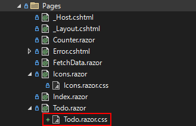

# 装飾する
code:  [Step 7](https://github.com/04100149/TodoList/releases/tag/step7)  

## Point
- [cssを定義する](#css%E3%82%92%E5%AE%9A%E7%BE%A9%E3%81%99%E3%82%8B)
- [cssに合わせて修正を行う](#css%E3%81%AB%E5%90%88%E3%82%8F%E3%81%9B%E3%81%A6%E4%BF%AE%E6%AD%A3%E3%82%92%E8%A1%8C%E3%81%86)
- [状況に合わせて色を変える](#%E7%8A%B6%E6%B3%81%E3%81%AB%E5%90%88%E3%82%8F%E3%81%9B%E3%81%A6%E8%89%B2%E3%82%92%E5%A4%89%E3%81%88%E3%82%8B)
- [Open/Closedが押せることをわかりやすくする](#openclosed%E3%81%8C%E6%8A%BC%E3%81%9B%E3%82%8B%E3%81%93%E3%81%A8%E3%82%92%E3%82%8F%E3%81%8B%E3%82%8A%E3%82%84%E3%81%99%E3%81%8F%E3%81%99%E3%82%8B)
- [Todoを期限順に並び変える](#todo%E3%82%92%E6%9C%9F%E9%99%90%E9%A0%86%E3%81%AB%E4%B8%A6%E3%81%B3%E5%A4%89%E3%81%88%E3%82%8B)
- [残り期間をわかりやすくする](#%E6%AE%8B%E3%82%8A%E6%9C%9F%E9%96%93%E3%82%92%E3%82%8F%E3%81%8B%E3%82%8A%E3%82%84%E3%81%99%E3%81%8F%E3%81%99%E3%82%8B)

## 手順
### cssを定義する
- Razorコンポーネントは、同じフォルダに`ファイル名+".css"`という名前でcssファイルを作っておくと、そのコンポーネントだけに適応される。
1. ソリューション エクスプローラの **Pages** フォルダを右クリックし、 コンテキストメニューの **追加 - クラス** をクリックする。
1. `スタイル シート`を選択する。  

1. 名前を **Todo.razor.css** にして **追加** ボタンを押す。
1. PagesフォルダにTodo.razor.cssが追加される。  

1. Todo.razor.cssを編集し、次のようにする。    
```CSS
div.section {
    display: inline-block; 
    vertical-align: top;
    background-color: lightskyblue;
    border-radius: 10px;
    margin: 10px; 
    padding: 10px; 
    box-sizing: border-box; 
}

div.section:hover {
    background-color: lightblue;
}

div.section p {
    clear: both;
}

div.section ul.icon {
    list-style: none;
    float: right;
    margin-bottom: 0px;
}

div.section ul.icon li {
    display: inline;
    margin-left: 5px;
    cursor: pointer;
}

div.section ul.icon li {
    opacity: 0;
}

div.section:hover ul.icon li {
    opacity: 0.5;
}

div.section ul.icon li:hover {
    opacity: 1;
}

.ellipsis {
    max-width: 300px;
    white-space: nowrap;
    overflow: hidden;
    text-overflow: ellipsis;
    margin-bottom: 0px;
}
```
6. Icons.razor.cssを保存する。  
### cssに合わせて修正を行う
1. Todo.razorを開き、Todo一つ分を`div`で囲みます。`div`の`class`は`section`とします。  
これによりTodoが角丸の矩形で囲まれます。
```diff
     @foreach(var todo in todos.Where<TodoItem>(x=>!x.IsDone || showClosed))
     {
+    <div class="section">
         <table>
             <tr>
                 <td align="right" valign="top"><span class="oi oi-key"/></td>
                 <td>
                     @todo.Id
                     <span class="oi oi-pencil" @onclick=@(_=>EditTodo(todo)) />
                     <span class="oi oi-check" @onclick=@(_=>DoneTodo(todo)) />
                     <span class="oi oi-trash" @onclick=@(_=>RemoveTodo(todo)) />
                 </td>
             </tr>
             <tr>
                 <td align="right" valign="top"><span class="oi oi-tag"/></td>
                 <td>@todo.Title</td>
             </tr>
             <tr>
                 <td align="right" valign="top"><span class="oi oi-clock"/></td>
                 <td>@todo.TargetDate.ToString("yyyy/MM/dd")</td>
             </tr>
             <tr>
                 <td align="right" valign="top"><span class="oi oi-comment-square"/></td>
                 <td >@todo.Memo</td>
             </tr>
         </table>
+    </div>
     }
```
2. 編集・完了・削除ボタンを`ul`で囲みます。`ul`の`class`は`icon`とします。各ボタンは`li`で囲みます。   
これにより編集・完了・削除ボタンは、マウスカーソルがTodoの上にある時だけ表示されるようになります。
```diff
                 <td>
                     @todo.Id
+                    <ul class="icon">
+                        <li>
                             <span class="oi oi-pencil" @onclick=@(_=>EditTodo(todo)) />
+                        </li>
+                        <li>
                             <span class="oi oi-check" @onclick=@(_=>DoneTodo(todo)) />
+                        </li>
+                        <li>
                             <span class="oi oi-trash" @onclick=@(_=>RemoveTodo(todo)) />
+                        </li>
+                    </ul>
                 </td>
```
3. メモが大きくなりすぎないように、`p`で囲みます。`p`の`class`は`ellipsis`とします。  
また、`title`アトリビュートにも`@todo.Memo`を入れておきます。  
これにより、メモ上にマウスカーソルがあるときに、ポップアップします。
```diff
             <tr>
                 <td align="right" valign="top"><span class="oi oi-comment-square"/></td>
-                <td >@todo.Memo</td>
+                <td ><p class="ellipsis" title=@todo.Memo>@todo.Memo</p></td>
             </tr>
```
4. Todo.razorを保存する。
### 状況に合わせて色を変える
- 次のように状況ごとに色を変える。  
  - 完了済み: Silver
  - 期限が当日: Khaki
  - 期限切れ: Lightpink
  - 期限が先：Lightblue
1. Todo.razorを開き、`@code{}`内に次の関数を追加する。
```C#
    private string GetBackgroundColor(TodoItem todo)
    {
        if (todo.IsDone){ return "silver"; }
        if (todo.TargetDate == DateTime.Today) { return "khaki"; }
        if (todo.TargetDate < DateTime.Today) { return "lightpink"; }
        return "lightblue";
    }
```
2. `div class="section"`に`style`アトリビュートを追加し、`background-color`に`GetBackgroundColor`の結果をセットする。
```diff
-    <div class="section">
+    <div class="section" style="background-color: @GetBackgroundColor(todo)">
```
3. Todo.razorを保存する。
### Open/Closedが押せることをわかりやすくする
- `Open`と`Closed`の上では、マウスカーソルの形を変える。
1. Todo.razorを開き、`Open`と`Closed`の`style`に`cursor: pointer;`を追加する。
```diff
     <span style="font-size: 0.5em;">
-        <span @onclick="@(_=>showClosed=false)" style="font-weight: @(showClosed ? "normal" : "bold");">@todos.Count(todo=>!todo.IsDone) Open</span>
+        <span @onclick="@(_=>showClosed=false)" style="cursor: pointer; font-weight: @(showClosed ? "normal" : "bold");">@todos.Count(todo=>!todo.IsDone) Open</span>
-        <span @onclick="@(_=>showClosed=true)" style="font-weight: @(showClosed ? "bold" : "normal");">@todos.Count(todo=>todo.IsDone) Closed</span>
+        <span @onclick="@(_=>showClosed=true)" style="cursor: pointer; font-weight: @(showClosed ? "bold" : "normal");">@todos.Count(todo=>todo.IsDone) Closed</span>
     </span>
```
2. Todo.razorを保存する。
### Todoを期限順に並び変える
1. Todo.razorを開き、`OrderBy`を追加する。
```diff
-    @foreach(var todo in todos.Where<TodoItem>(x=>!x.IsDone || showClosed))
+    @foreach(var todo in todos.Where<TodoItem>(x=>!x.IsDone || showClosed).OrderBy<TodoItem, DateTime>(x=>x.TargetDate))
```
2. Todo.razorを保存する。
### 残り期間をわかりやすくする
- 次のように状況に合わせて情報を表示する。
  - 完了済み: 完了した日付
  - 期限が当日: `今日まで！`
  - 期限切れ: `x日 オーバー`
  - 期限が先：`あと x日`
1. Todo.razorを開き、期限の隣に情報を追加する。
```diff
             <tr>
                 <td align="right" valign="top"><span class="oi oi-clock"/></td>
-                <td>@todo.TargetDate.ToString("yyyy/MM/dd")</td>
+                <td>
+                    @todo.TargetDate.ToString("yyyy/MM/dd")
+                    @if(todo.IsDone)
+                    {
+                        <span class="oi oi-check" style="margin-left: 10px;"/>
+                        @todo.EndDate.ToString("yyyy/MM/dd")
+                    }
+                    else
+                    {
+                        var days = (todo.TargetDate - DateTime.Today).Days;
+                        @if(days == 0)
+                        {
+                            <span style="color: red; margin-left: 10px;">今日まで！</span>
+                        }
+                        else if(days<0)
+                        {
+                            <span style="color: red; margin-left: 10px;">@(-days)日 オーバー</span>
+                        }
+                        else
+                        {
+                            <span style="color: black; margin-left: 10px;">あと @(days)日</span>                            
+                        }
+                    }
+                </td>
             </tr>
```
2. [Todo.razor]()を保存する。

code:  [Step 8](https://github.com/04100149/TodoList/releases/tag/step8)  

## 動作確認
1.  ボタンをクリックする。  
1. ビルド後、開発用コンテナが開始され、ブラウザが起動する。  

1. サイドメニューの **Todo** をクリックすると、Todoページが開く。    

1. 期限が未来、今日、過去のTodoを追加し、`Closed`をクリックする。  
- 期限順に表示される。
- 状況ごとに色分けされる。


***
- Prev [完了したTodoを表示できるようにする](docs/0008showclosed.md)
- Next [モジュール化する](docs/0010modularization.md)

