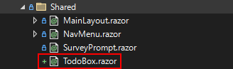
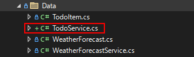
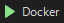
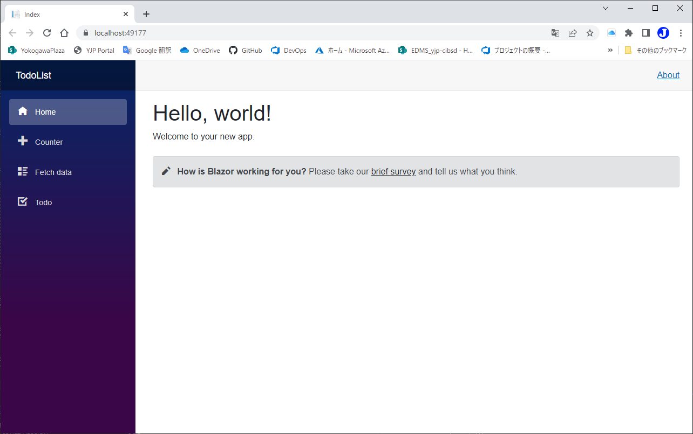
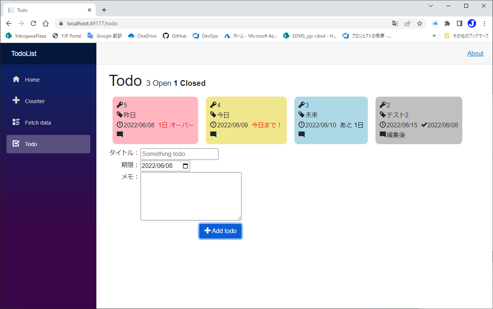

# モジュール化する
code:  [Step 8](https://github.com/04100149/TodoList/releases/tag/step8)  

## Point
- [razorコンポーネント化する](#razor%E3%82%B3%E3%83%B3%E3%83%9D%E3%83%BC%E3%83%8D%E3%83%B3%E3%83%88%E5%8C%96%E3%81%99%E3%82%8B)
- [永続化コードをサービス化する](#%E6%B0%B8%E7%B6%9A%E5%8C%96%E3%82%B3%E3%83%BC%E3%83%89%E3%82%92%E3%82%B5%E3%83%BC%E3%83%93%E3%82%B9%E5%8C%96%E3%81%99%E3%82%8B)

## 手順
### razorコンポーネント化する
- Todoの表示部分をRazorコンポーネント化する。
  - `TodoItem`を引数に受け取り情報を表示する。
  - 編集/完了/削除ボタンのイベントを用意する。 
1. ソリューション エクスプローラの **Shared** フォルダを右クリックし、 コンテキストメニューの **追加 - Razor コンポーネント** をクリックする。
1. 名前を **TodoBox.razor** にして **追加** ボタンを押す。
1. SharedフォルダにTodoBox.razorが追加される。  

1. TodoBox.razorを編集し、**Todo.razor**からTodo表示部分をコピーする。    
```HTML+razor
    <div class="section" style="background-color: @GetBackgroundColor(todo)">
        <table>
            <tr>
                <td align="right" valign="top"><span class="oi oi-key"/></td>
                <td>
                    @todo.Id
                    <ul class="icon">
                        <li>
                            <span class="oi oi-pencil" @onclick=@(_=>EditTodo(todo)) />
                        </li>
                        <li>
                            <span class="oi oi-check" @onclick=@(_=>DoneTodo(todo)) />
                        </li>
                        <li>
                            <span class="oi oi-trash" @onclick=@(_=>RemoveTodo(todo)) />
                        </li>
                    </ul>
                </td>
            </tr>
            <tr>
                <td align="right" valign="top"><span class="oi oi-tag"/></td>
                <td>@todo.Title</td>
            </tr>
            <tr>
                <td align="right" valign="top"><span class="oi oi-clock"/></td>
                <td>
                    @todo.TargetDate.ToString("yyyy/MM/dd")
                    @if(todo.IsDone)
                    {
                        <span class="oi oi-check" style="margin-left: 10px;"/>
                        @todo.EndDate.ToString("yyyy/MM/dd")
                    }
                    else
                    {
                        var days = (todo.TargetDate - DateTime.Today).Days;
                        @if(days == 0)
                        {
                            <span style="color: red; margin-left: 10px;">今日まで！</span>
                        }
                        else if(days<0)
                        {
                            <span style="color: red; margin-left: 10px;">@(-days)日 オーバー</span>
                        }
                        else
                        {
                            <span style="color: black; margin-left: 10px;">あと @(days)日</span>                            
                        }
                    }
                </td>
            </tr>
            <tr>
                <td align="right" valign="top"><span class="oi oi-comment-square"/></td>
                <td ><p class="ellipsis" title=@todo.Memo>@todo.Memo</p></td>
            </tr>
        </table>
    </div>
```
2. **Todo.razor**から`GetBackgroundColor()`を移動し、`@code{}`内に配置する。
```HTML+razor
@code {
    
    private string GetBackgroundColor(TodoItem todo)
    {
        if (todo.IsDone){ return "silver"; }
        if (todo.TargetDate == DateTime.Today) { return "khaki"; }
        if (todo.TargetDate < DateTime.Today) { return "lightpink"; }
        return "lightblue";
    }
}
```
3. `TodoItem`が使えるように、先頭に`@using TodoList.Data`を追加する。
```diff
+@using TodoList.Data
```
4. `TodoItem`を外部から渡せるように`[Parameter]`属性のプロパティを追加する。
```diff
 @code {
+    [Parameter]
+    public TodoItem Item { get; set; }
 
     private string GetBackgroundColor(TodoItem todo)
```
5. 表示部分の`todo`を`Item`に置換する。  
6. ボタン用の`[Parameter]`属性の`EventCallback`を追加する。
```diff
     [Parameter]
     public TodoItem Item { get; set; }
 
+    [Parameter]
+    public EventCallback<TodoItem> OnClickEditCallback { get; set; }
+
+    [Parameter]
+    public EventCallback<TodoItem> OnClickDoneCallback { get; set; }
+
+    [Parameter]
+    public EventCallback<TodoItem> OnClickRemoveCallback { get; set; }
 
     private string GetBackgroundColor(TodoItem Item)
```
7. ボタンの`@onclick`で`EventCallback`を呼ぶように変更する。
```diff
                     <ul class="icon">
                         <li>
-                            <span class="oi oi-pencil" @onclick=@(_=>EditTodo(Item)) />
+                            <span class="oi oi-pencil" @onclick=@(async ()=> await OnClickEditCallback.InvokeAsync(Item)) />
                         </li>
                         <li>
-                            <span class="oi oi-check" @onclick=@(_=>DoneTodo(Item)) />
+                            <span class="oi oi-check" @onclick=@(async ()=> await OnClickDoneCallback.InvokeAsync(Item)) />
                         </li>
                         <li>
-                            <span class="oi oi-trash" @onclick=@(_=>RemoveTodo(Item)) />
+                            <span class="oi oi-trash" @onclick=@(async ()=> await OnClickRemoveCallback.InvokeAsync(Item)) />
                         </li>
                     </ul>
```
8. [TodoBox.razor]()を保存する。
9. **Todo.razor** を開き、表示部分をコンポーネント呼び出しに変更する。
```diff
     @foreach(var todo in todos.Where<TodoItem>(x=>!x.IsDone || showClosed).OrderBy<TodoItem, DateTime>(x=>x.TargetDate))
     {
+        <TodoBox Item=@todo 
+            OnClickEditCallback=@(item=>EditTodo(item))
+            OnClickDoneCallback=@(item=>DoneTodo(item))
+            OnClickRemoveCallback=@(item=>RemoveTodo(item))/>
-    <div class="section" style="background-color: @GetBackgroundColor(todo)">
-        <table>
-            <tr>
-                <td align="right" valign="top"><span class="oi oi-key"/></td>
-                <td>
-                    @todo.Id
-                    <ul class="icon">
-                        <li>
-                            <span class="oi oi-pencil" @onclick=@(_=>EditTodo(todo)) />
-                        </li>
-                        <li>
-                            <span class="oi oi-check" @onclick=@(_=>DoneTodo(todo)) />
-                        </li>
-                        <li>
-                            <span class="oi oi-trash" @onclick=@(_=>RemoveTodo(todo)) />
-                        </li>
-                    </ul>
-                </td>
-            </tr>
-            <tr>
-                <td align="right" valign="top"><span class="oi oi-tag"/></td>
-                <td>@todo.Title</td>
-            </tr>
-            <tr>
-                <td align="right" valign="top"><span class="oi oi-clock"/></td>
-                <td>
-                    @todo.TargetDate.ToString("yyyy/MM/dd")
-                    @if(todo.IsDone)
-                    {
-                        <span class="oi oi-check" style="margin-left: 10px;"/>
-                        @todo.EndDate.ToString("yyyy/MM/dd")
-                    }
-                    else
-                    {
-                        var days = (todo.TargetDate - DateTime.Today).Days;
-                        @if(days == 0)
-                        {
-                            <span style="color: red; margin-left: 10px;">今日まで！</span>
-                        }
-                        else if(days<0)
-                        {
-                            <span style="color: red; margin-left: 10px;">@(-days)日 オーバー</span>
-                        }
-                        else
-                        {
-                            <span style="color: black; margin-left: 10px;">あと @(days)日</span>                            
-                        }
-                    }
-                </td>
-            </tr>
-            <tr>
-                <td align="right" valign="top"><span class="oi oi-comment-square"/></td>
-                <td ><p class="ellipsis" title=@todo.Memo>@todo.Memo</p></td>
-            </tr>
-        </table>
-    </div>
     }
```
10. Todo.razorを保存する。
11. ソリューション エクスプローラの **Shared** フォルダを右クリックし、 コンテキストメニューの **追加 - クラス** をクリックする。
12. `スタイル シート`を選択する。  

13. 名前を **TodoBox.razor.css** にして **追加** ボタンを押す。
14. SharedフォルダにTodoBox.razor.cssが追加される。  

15. TodoBox.razor.cssを編集し、Todo.razor.cssの内容を移動する。    
```CSS
div.section {
    display: inline-block;
    vertical-align: top;
    background-color: lightskyblue;
    border-radius: 10px;
    margin: 10px;
    padding: 10px;
    box-sizing: border-box;
}

    div.section:hover {
        background-color: lightblue;
    }

    div.section p {
        clear: both;
    }

    div.section ul.icon {
        list-style: none;
        float: right;
        margin-bottom: 0px;
    }

        div.section ul.icon li {
            display: inline;
            margin-left: 5px;
            cursor: pointer;
        }

        div.section ul.icon li {
            opacity: 0;
        }

    div.section:hover ul.icon li {
        opacity: 0.5;
    }

    div.section ul.icon li:hover {
        opacity: 1;
    }

.ellipsis {
    max-width: 300px;
    white-space: nowrap;
    overflow: hidden;
    text-overflow: ellipsis;
    margin-bottom: 0px;
}
```
16. [TodoBox.razor.css]()を保存する。
### 永続化コードをサービス化する
1. ソリューション エクスプローラの **Data** フォルダを右クリックし、 コンテキストメニューの **追加 - クラス** をクリックする。
1. 名前を **TodoService.cs** にして **追加** ボタンを押す。  

1. **TodoService.cs** を編集し、Todo.razorから永続化のコードを移動する。  
```C#
namespace TodoList.Data
{
    public class TodoService
    {
        #region 永続化
        private const string todoFolder = @"./wwwroot/todos";

        private string GetPath(int id)
        {
            return string.Format(@"{0}/{1}.json", todoFolder, id);
        }

        private void SaveTodoFile(TodoItem todo)
        {
            string json = JsonSerializer.Serialize(todo);
            string path = GetPath(todo.Id);
            using (StreamWriter sw = new StreamWriter(path, false, Encoding.UTF8))
            {
                sw.Write(json);
            }
        }

        private List<TodoItem> LoadTodoFiles()
        {
            List<TodoItem> todos = new List<TodoItem>();
            foreach (var path in Directory.EnumerateFiles(todoFolder))
            {
                using (StreamReader sr = new StreamReader(path, Encoding.UTF8))
                {
                    string json = sr.ReadToEnd();
                    TodoItem? todo = JsonSerializer.Deserialize<TodoItem>(json);
                    if (todo != null)
                    {
                        todos.Add(todo);
                    }
                }
            }
            return todos;
        }

        private void RemoveTodoFile(int id)
        {
            string path = GetPath(id);
            try
            {
                File.Delete(path);
            }
            catch (Exception ex)
            {
                System.Diagnostics.Trace.WriteLine(ex.Message);
            }
        }
        #endregion 永続化
    }
}
```
4. 先頭に`using`を追加する。  
```diff
+using System.Text;
+using System.Text.Json;
```
5. 次のように`public`メソッドを追加する。  
```C#
        public void SaveTodo(TodoItem todo)
        {
            SaveTodoFile(todo);
        }
        public List<TodoItem> LoadTodos()
        {
            return LoadTodoFiles();
        }
        public void RemoveTodo(TodoItem todo)
        {
            RemoveTodoFile(todo.Id);
        }
```
6. [TodoService.cs]()を保存する。
7. `Program.cs`を編集し、`TodoService`を`Singleton`として登録する。
```diff
 // Add services to the container.
 builder.Services.AddRazorPages();
 builder.Services.AddServerSideBlazor();
 builder.Services.AddSingleton<WeatherForecastService>();
+builder.Services.AddSingleton<TodoService>();
```
8. [Program.cs]()を保存する。
9. Todo.razorを編集し、`TodoService`を`inject`する。
```diff
 @page "/todo"
 @using System.Text
 @using System.Text.Json
 @using TodoList.Data
+@inject TodoService TodoService
 
 <PageTitle>Todo</PageTitle>
```
10. `OnInitialize`を次のように変更する。  
```diff
     protected override void OnInitialized()
     {
-        todos = LoadTodoFiles();
+        todos = TodoService.LoadTodos();
         latestId = todos.Select<TodoItem, int>(x => x.Id).DefaultIfEmpty().Max() + 1;
     }
```
11. `AddTodo`を次のように変更する。  
```diff
     private void AddTodo()
     {
         if (!string.IsNullOrWhiteSpace(newTodo))
         {
             TodoItem todo = new TodoItem {Id=latestId++, Title = newTodo, TargetDate = newDate, Memo=newMemo };
             newTodo = string.Empty;
             newMemo = string.Empty;
             todos.Add(todo);
-            SaveTodoFile(todo);
+            TodoService.SaveTodo(todo);
         }
     }
```
12. `DoneEdit``DoneTodo``RemoveTodo`を次のように変更する。
```diff
     private void DoneEdit()
     {
         if (!string.IsNullOrWhiteSpace(newTodo))
         {
             editingItem.Title = newTodo;
             editingItem.TargetDate = newDate;
             editingItem.Memo = newMemo;
-            SaveTodoFile(editingItem);
+            TodoService.SaveTodo(editingItem);
             InitializeEdit();
         }
     }
 
     private void DoneTodo(TodoItem todo)
     {
         todo.EndDate = DateTime.Today;
         todo.IsDone = true;
-        SaveTodoFile(todo);
+        TodoService.SaveTodo(todo);
     }
 
     private void RemoveTodo(TodoItem todo)
     {
         todos.Remove(todo);
-        RemoveTodoFile(todo.Id);
+        TodoService.RemoveTodo(todo);
     }     
```
13. [Todo.razor]()を保存する。

code:  [Step 9](https://github.com/04100149/TodoList/releases/tag/step9)  

## 動作確認
1.  ボタンをクリックする。  
1. ビルド後、開発用コンテナが開始され、ブラウザが起動する。  

1. サイドメニューの **Todo** をクリックすると、Todoページが開く。    

1. `Closed`をクリックする。  
- 期限順に表示される。
- 状況ごとに色分けされる。


***
- Prev [装飾する](docs/0009decoration.md)
- Next [複数クライアント対応](docs/0011multiclient.md)

