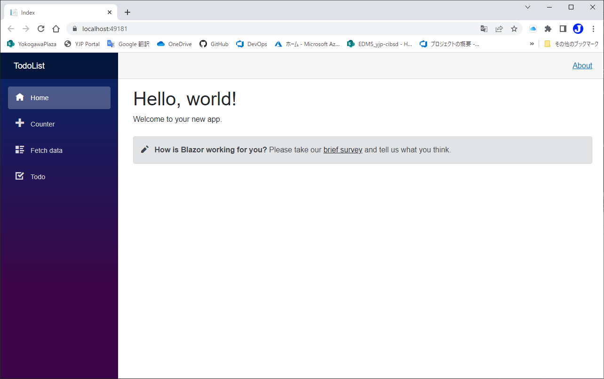
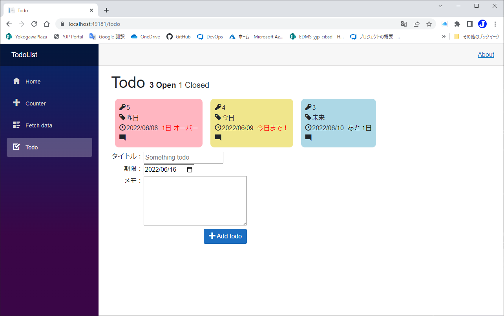
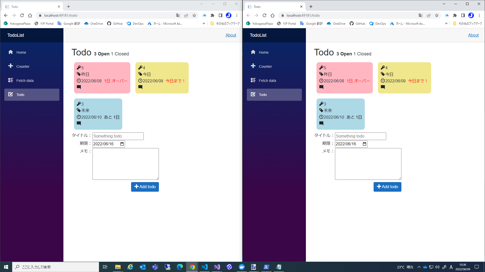
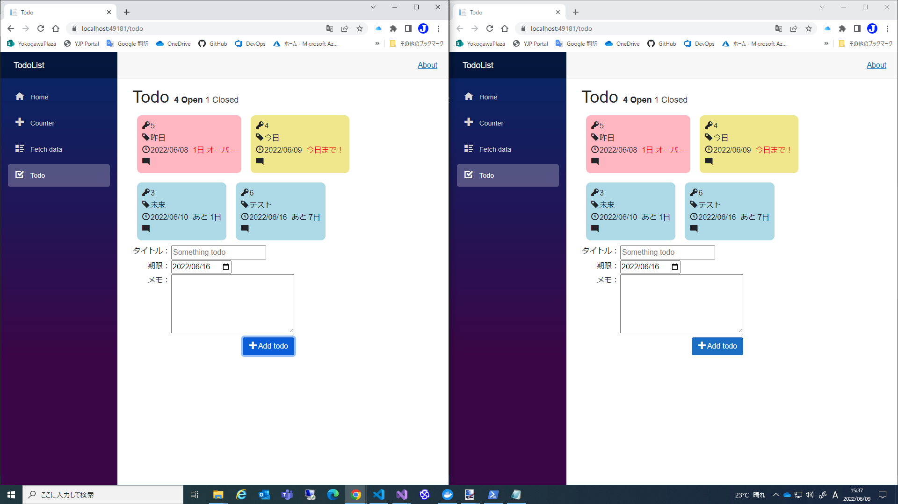

# 複数クライアント対応
code:  [Step 9](https://github.com/04100149/TodoList/releases/tag/step9)  

## Point
- [TodoServiceにイベントを追加する](#todoservice%E3%81%AB%E3%82%A4%E3%83%99%E3%83%B3%E3%83%88%E3%82%92%E8%BF%BD%E5%8A%A0%E3%81%99%E3%82%8B)
- [Idの管理をTodoServiceに移す](#id%E3%81%AE%E7%AE%A1%E7%90%86%E3%82%92todoservice%E3%81%AB%E7%A7%BB%E3%81%99)
- [イベントにより表示を更新する](#%E3%82%A4%E3%83%99%E3%83%B3%E3%83%88%E3%81%AB%E3%82%88%E3%82%8A%E8%A1%A8%E7%A4%BA%E3%82%92%E6%9B%B4%E6%96%B0%E3%81%99%E3%82%8B)

## 手順
### TodoServiceにイベントを追加する
1. TodoService.csを編集し、`EventHandler`を追加する。`Todo`が変化するタイミングでイベントを発行する。      
```diff
+        public event EventHandler TodoChanged = delegate { };
         public void SaveTodo(TodoItem todo)
         {
             SaveTodoFile(todo);
+            TodoChanged(this, EventArgs.Empty);
         }
         public List<TodoItem> LoadTodos()
         {
             return LoadTodoFiles();
         }
         public void RemoveTodo(TodoItem todo)
         {
             RemoveTodoFile(todo.Id);
+            TodoChanged(this, EventArgs.Empty);
         }
```
2. TodoService.csを保存する。
### Idの管理をTodoServiceに移す
1. TodoService.csを編集し、`latestId`を追加する。  
```diff
     public class TodoService
     {
         public event EventHandler TodoChanged = delegate { };
+        private int latestId;         
         public void SaveTodo(TodoItem todo)
```
2. `latestId`を初期化するためにコンストラクタを追加する。  
```diff
     public class TodoService
     {
         public event EventHandler TodoChanged = delegate { };
         private int latestId;
+        public TodoService()
+        {
+            List<TodoItem> todos = LoadTodoFiles();
+            latestId = todos.Select<TodoItem, int>(x => x.Id).DefaultIfEmpty().Max() + 1;
+        }
         public void SaveTodo(TodoItem todo)
```
3. `Todo`の追加用メソッドを追加する。   
```diff
          public TodoService()
          {
             List<TodoItem> todos = LoadTodoFiles();
             latestId = todos.Select<TodoItem, int>(x => x.Id).DefaultIfEmpty().Max() + 1;
         }
+        public void AddTodo(TodoItem todo)
+        {
+            todo.Id = latestId++;
+            SaveTodoFile(todo);
+        }
         public void SaveTodo(TodoItem todo)
```
4. 同期処理を追加する。  
```diff
         public TodoService()
         {
+            lock (this)
+            {
                 List<TodoItem> todos = LoadTodoFiles();
                 latestId = todos.Select<TodoItem, int>(x => x.Id).DefaultIfEmpty().Max() + 1;
+            }
         }
         public void AddTodo(TodoItem todo)
         {
+            lock (this)
+            {
                 todo.Id = latestId++;
                 SaveTodoFile(todo);
                 TodoChanged(this, EventArgs.Empty);
+            }
         }
         public void SaveTodo(TodoItem todo)
         {
+            lock (this)
+            {
                 SaveTodoFile(todo);
                 TodoChanged(this, EventArgs.Empty);
+            }
         }
         public List<TodoItem> LoadTodos()
         {
+            lock (this)
+            {
                 return LoadTodoFiles();
+            }
         }
         public void RemoveTodo(TodoItem todo)
         {
+            lock (this)
+            {
                 RemoveTodoFile(todo.Id);
                 TodoChanged(this, EventArgs.Empty);
+            }
         }
```
5. TodoService.csを保存する。
6. **Todo.razor**を編集し、`latestId`を削除する。
```diff
     private bool showClosed = false;
 
-    private int latestId = 1;
     private string? newTodo;
     private DateTime newDate = DateTime.Today.AddDays(7);
     private string newMemo;
```
```diff
     protected override void OnInitialized()
     {
         todos = TodoService.LoadTodos();
-        latestId = todos.Select<TodoItem, int>(x => x.Id).DefaultIfEmpty().Max() + 1;
     }
```
7. `AddTodo`で`TodoService.AddTodo`を使うように変更する。  
```diff
     private void AddTodo()
     {
         if (!string.IsNullOrWhiteSpace(newTodo))
         {
-            TodoItem todo = new TodoItem {Id=latestId++, Title = newTodo, TargetDate = newDate, Memo=newMemo };
+            TodoService.AddTodo(new TodoItem {Title = newTodo, TargetDate = newDate, Memo=newMemo });
 
             newTodo = string.Empty;
             newMemo = string.Empty;
-            todos.Add(todo);
-            TodoService.SaveTodo(todo);
         }
     }
```
8. Todo.razorを保存する。
### イベントにより表示を更新する
1. **Todo.razor**を編集し、`OnInitialized()`で、`TodoService`のイベントをハンドルする。  
ハンドラでは、`Todo`を読み直し、画面のスレッドで`StateHasChanged`を実行する。
```diff
     protected override void OnInitialized()
     {
         todos = TodoService.LoadTodos();
+        TodoService.TodoChanged += TodoChanged;
     }
 
+    private async void TodoChanged(object? sender, EventArgs args)
+    {
+        todos = TodoService.LoadTodos();    
+        await InvokeAsync(StateHasChanged);
+    }
```
2. 終了時にイベントを解放するために、`Todo`を`IDisposable`にする。  
```diff
 @page "/todo"
 @using System.Text
 @using System.Text.Json
 @using TodoList.Data
 @inject TodoService TodoService
+@implements IDisposable
 
 <PageTitle>Todo</PageTitle>
```
3. `Dispose`メソッドでイベントを解放する。
```C#
    public void Dispose()
    {
        TodoService.TodoChanged -= TodoChanged;
    }
```
4. [Todo.razor]()を保存する。

code:  [Step 10](https://github.com/04100149/TodoList/releases/tag/step10)  

## 動作確認
1.  ボタンをクリックする。  
1. ビルド後、開発用コンテナが開始され、ブラウザが起動する。  

1. サイドメニューの **Todo** をクリックすると、Todoページが開く。    

1. サイドメニューの **Todo** を右クリックして、新しいウィンドウで開く。  

1. `Todo`を追加すると、両方のウィンドウに表示される。


***
- Prev [モジュール化する](0010modularization.md)
- Next [Dockerでホストする](0012docker.md)

