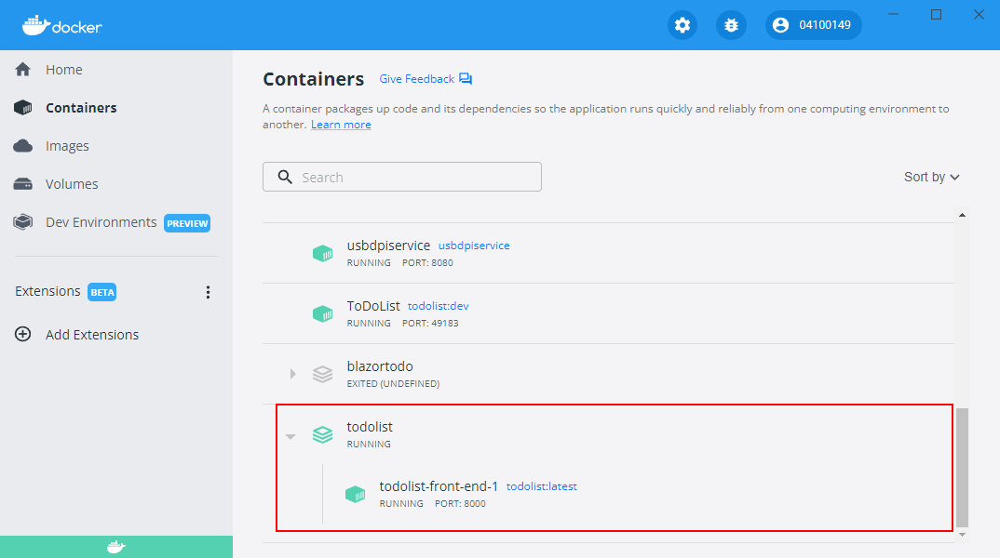
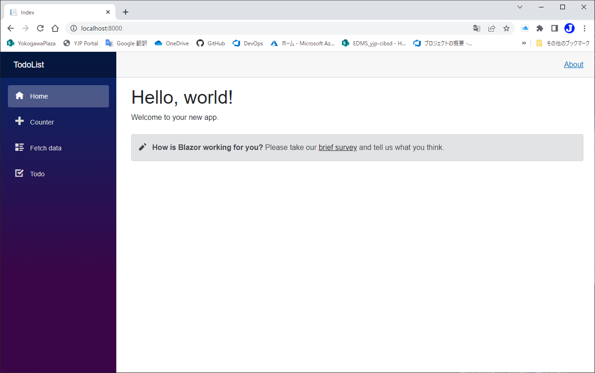

# Dockerでホストする
code:  [Step 10](https://github.com/04100149/TodoList/releases/tag/step10)  

## Point
- [Dockerイメージをビルドする](#docker%E3%82%A4%E3%83%A1%E3%83%BC%E3%82%B8%E3%82%92%E3%83%93%E3%83%AB%E3%83%89%E3%81%99%E3%82%8B)
- [Compose.ymlを定義する](#composeyml%E3%82%92%E5%AE%9A%E7%BE%A9%E3%81%99%E3%82%8B)
- [Docker Composeで実行する](#docker-compose%E3%81%A7%E5%AE%9F%E8%A1%8C%E3%81%99%E3%82%8B)

## 手順
### Dockerイメージをビルドする
1. `Dockerfile`を編集し、`Zscaler`の証明書をBuild用イメージにコピーするようにする。(社内のみ有効)        
```diff
 #See https://aka.ms/containerfastmode to understand how Visual Studio uses this Dockerfile to build your images for faster debugging.
 
 FROM mcr.microsoft.com/dotnet/aspnet:6.0 AS base
 WORKDIR /app
 EXPOSE 80
 EXPOSE 443
 
 FROM mcr.microsoft.com/dotnet/sdk:6.0 AS build
 WORKDIR /src
+
+RUN apt-get update && apt-get install -y unzip
+ADD http://aww001-0m0176.jp.ykgw.net/content/files/NW/Internet/ZscalerRootCertificate-2048-SHA256.zip /tmp
+Run unzip /tmp/ZscalerRootCertificate-2048-SHA256.zip -d /usr/local/share/ca-certificates/
+RUN chmod 644 /usr/local/share/ca-certificates/ZscalerRootCertificate-2048-SHA256.crt && update-ca-certificates
+
 COPY ["TodoList/TodoList.csproj", "TodoList/"]
 RUN dotnet restore "TodoList/TodoList.csproj"
 COPY . .
 WORKDIR "/src/TodoList"
 RUN dotnet build "TodoList.csproj" -c Release -o /app/build
 
 FROM build AS publish
 RUN dotnet publish "TodoList.csproj" -c Release -o /app/publish
 
 FROM base AS final
 WORKDIR /app
 COPY --from=publish /app/publish .
 ENTRYPOINT ["dotnet", "TodoList.dll"]
```
2. [Dockerfile]()を保存する。
3. `Dockerfile`を右クリックして、`Dockerイメージのビルド`を実行する。
### Compose.ymlを定義する
1. ソリューション エクスプローラの **TotoList** フォルダを右クリックし、 コンテキストメニューの **追加 - 新しい項目** をクリックする。
1. `テキストファイル`を選択する。  

1. 名前を **Compose.yml** にして **追加** ボタンを押す。
1. Compose.ymlが追加される。  

1. Compose.ymlを編集し、次のようにする。    
```YAML
version: "3"
services:
  front-end:
    image: todolist:latest
    ports:
     - 8000:80
    volumes:
      - todos:/app/wwwroot/todos
volumes:
  todos:
```
6. `8000`ポートが使用済みならば、空いているポート番号に変更する。  
1. Compose.ymlを保存する。
### Docker Composeで実行する
1. ソリューション エクスプローラの **TotoList** フォルダを右クリックし、 コンテキストメニューの **ターミナルで開く** をクリックする。
1. `開発者用 PowerShell`が開く。  

1. 次のコマンドを実行する。  
```
docker compose up -d
```
4. コンテナイメージが実行される。  

5. 'Docker Desktop'を開くと、実行されていることが確認できる。  



code:  [Step 11](https://github.com/04100149/TodoList/releases/tag/step11)  

## 動作確認
1. ブラウザを起動し、次のアドレスへ接続する。  
```
http://localhost:8000
```
1. ブラウザでアプリケーションが開く。 

1. サイドメニューの **Todo** をクリックすると、Todoページが開く。    

1. `Docker Desktop`を起動し、`Volumes`をクリックする。  

1. `todolist_todos`をクリックすると、`Volume`が開く。  

1. `DATA`をクリックすると、`Todo`のjsonファイルが一覧できる。    


***
- Prev [複数クライアント対応](0011multiclient.md)


